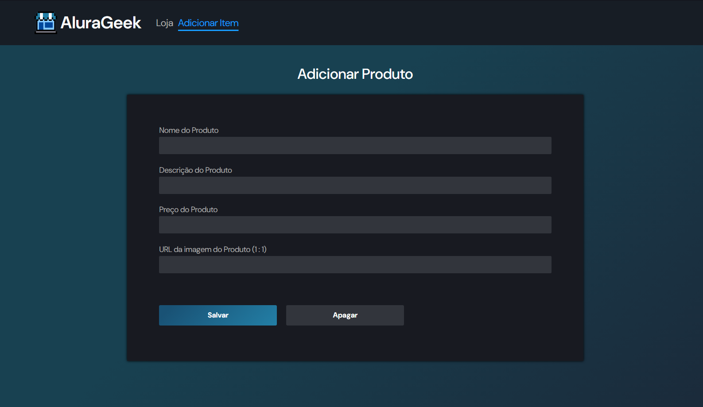

# Desafio AluraGeek Alura One ⭐
Este projeto é referente a um desafio de desenvolver uma plataforma de E-Commerce proposto no programa de Front-end da Alura ONE (T6), onde o mesmo foi feito com o objetivo de praticar as habilidades de *HTML, CSS* e *Javascript* desenvolvidas ao longo do curso. Além disso, a temática visual do projeto foi baseada na plataforma de jogos *Steam*.

